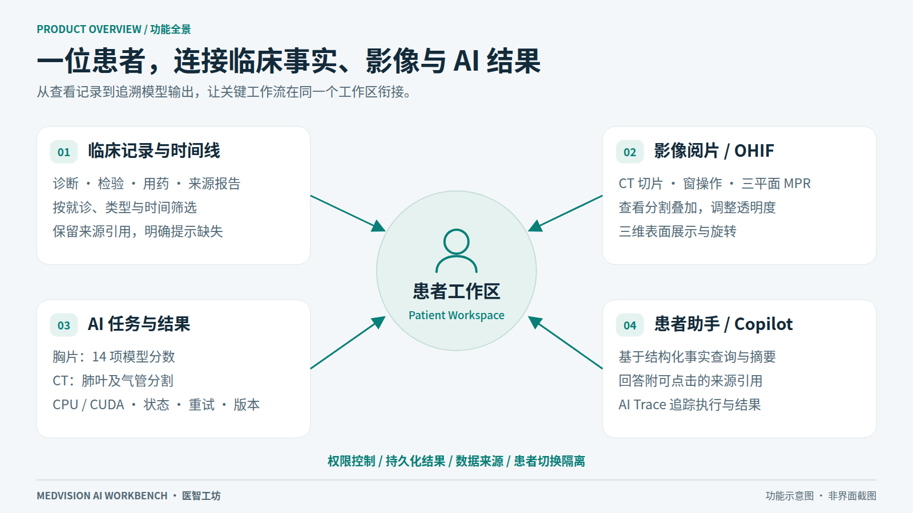
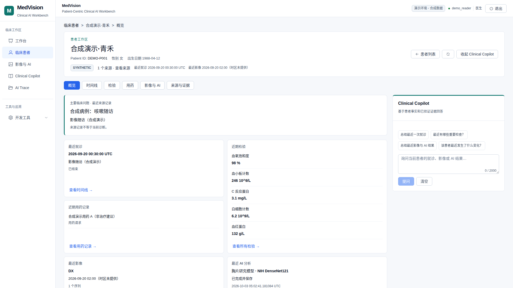
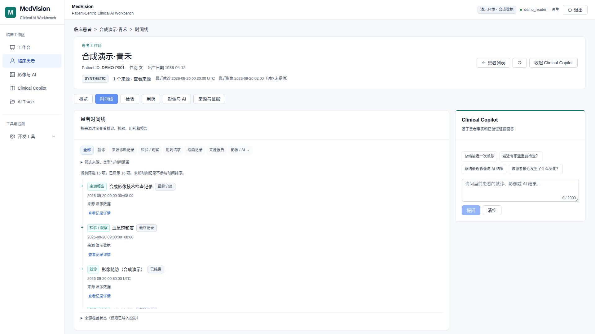
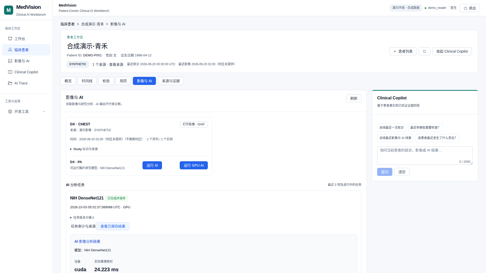
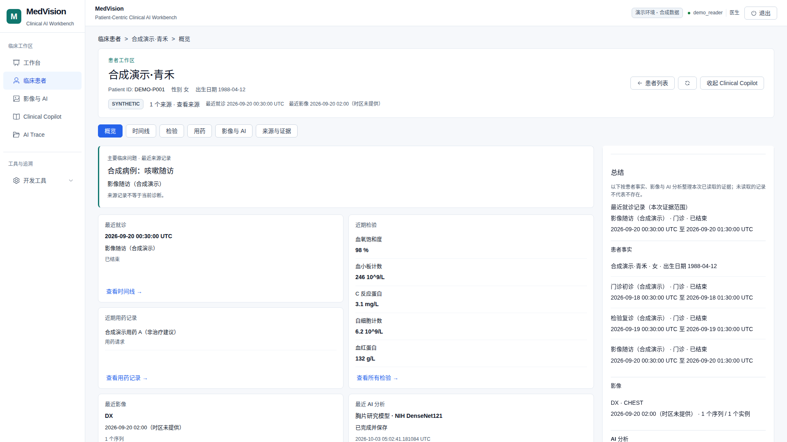
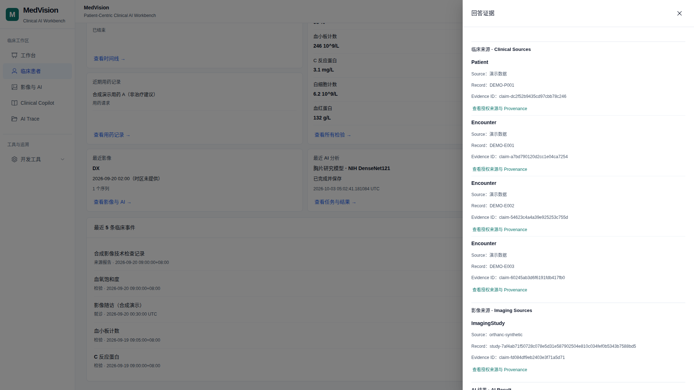
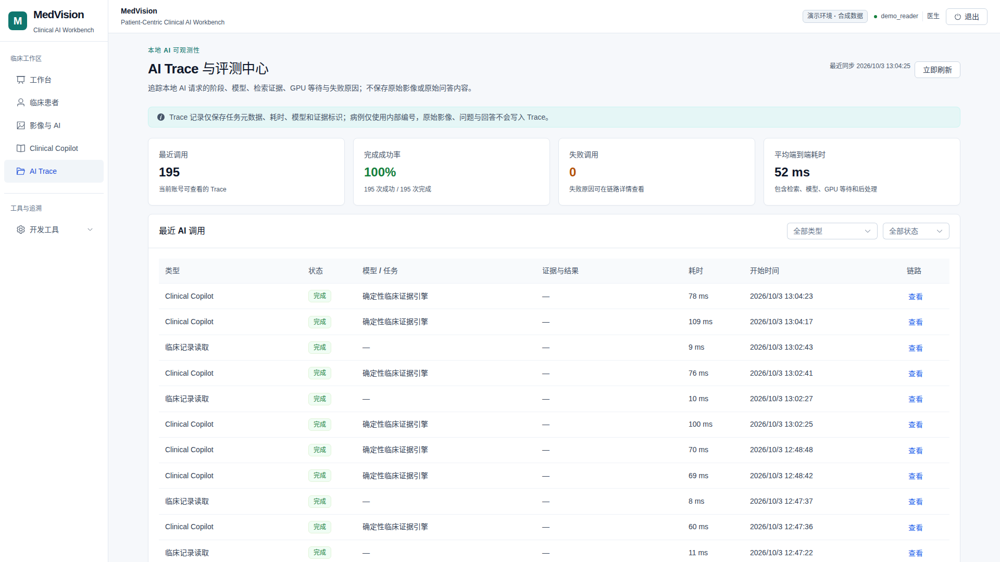
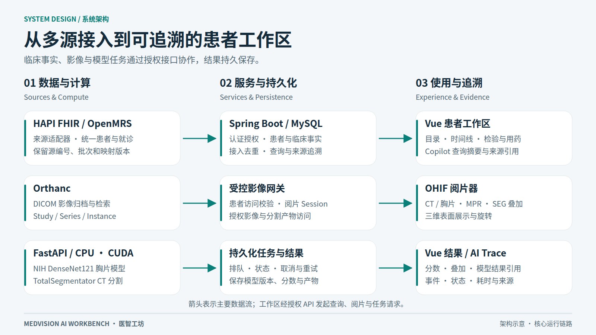
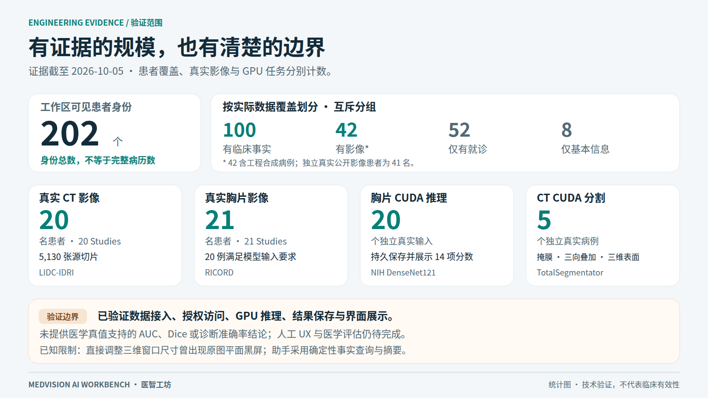

<h1 align="center">MedVision · Clinical AI Workbench</h1>

<p align="center">以患者为中心的临床与影像 AI 工作台</p>

<p align="center">
  <b>临床时间线</b> · <b>受控影像阅片</b> · <b>胸片 AI</b> · <b>CT 分割与三维展示</b> · <b>带来源的患者助手</b>
</p>

<p align="center">
  <a href="#项目简介">项目简介</a> ·
  <a href="#数据来源">数据来源</a> ·
  <a href="#主要功能">主要功能</a> ·
  <a href="#功能演示">功能演示</a> ·
  <a href="#技术架构">技术架构</a> ·
  <a href="#工程验证">工程验证</a> ·
  <a href="#运行说明">运行说明</a>
</p>

> **版本说明：** 项目已在原 CT/MRI 工作站基础上发展为患者工作台。下面的新版功能与指标来自本地开发版及截至 **2026-10-05** 的工程验收；本次同步的是 README、配图和验证摘要。GitHub `main` 中的应用源码仍为原 CT/MRI 基线与 Windows 移植版，新版临床工作台源码尚未同步。



## 项目简介

MedVision 将分散的临床记录、影像和模型结果放回患者上下文，让使用者从查看记录、打开影像、运行 AI，到核对来源，在一个工作区内完成操作。

新版使用 **MIMIC-IV FHIR Demo、LIDC-IDRI 和 MIDRC-RICORD-1C 的公开去标识数据**开展临床记录接入、真实影像阅片和模型任务验证，并使用独立合成病例进行界面演示与边界测试。

项目由 PPGL CT 与脑胶质瘤 MRI 分析工作站逐步改进。新版通过确定性来源映射整合临床记录，通过受控 DICOM 网关连接阅片器，通过持久任务保存模型结果，并提供可核对引用的患者事实助手。

典型流程：**选择患者 → 查看概览与时间线 → 打开影像 → 运行模型或读取已有结果 → 查询患者事实 → 核对引用与执行记录。**

这是独立工程项目，用于学习、科研开发和软件流程验证，未在医院部署，未经临床有效性验证。

## 数据来源

临床记录和医学影像分别从公开数据集接入，保留各自来源身份。HAPI FHIR 和 OpenMRS 是接入平台，具体数据来源如下：

| 数据集 | 数据性质 | 当前接入与用途 |
| --- | --- | --- |
| [MIMIC-IV Clinical Database Demo on FHIR 2.1.0](https://physionet.org/content/mimic-iv-fhir-demo/2.1.0/) | 来自真实临床记录的公开去标识 FHIR 数据 | 100 名患者的临床数据，经 HAPI FHIR 接入，用于时间线、检验、用药、来源查询与患者事实摘要验证。 |
| [LIDC-IDRI](https://www.cancerimagingarchive.net/collection/lidc-idri/) | TCIA 公开去标识胸部 CT | 20 名患者、5,130 张切片，用于阅片；其中 5 个独立病例完成 CT 分割及三维展示。 |
| [MIDRC-RICORD-1C](https://www.cancerimagingarchive.net/collection/midrc-ricord-1c/) | TCIA 公开去标识胸片 | 21 名患者用于本地阅片验证，其中 20 例完成 CUDA 模型推理及结果保存。 |
| [Synthea](https://synthetichealth.github.io/synthea/) 兼容记录与合成测试病例 | 合成开发数据 | 用于 OpenMRS 接入、重复导入、权限隔离、缺失状态及界面演示。 |

MIMIC 名称中的 **Demo** 指公开临床数据库子集，其记录来源于去标识化的真实临床数据。系统里的合成演示病例单独用于展示和回归，不代表上述公开数据集。

当前 202 个可见身份还包含历史开发记录，数据覆盖程度不同。临床数据与 CT / 胸片患者分别来自独立数据集，未将其拼接为同一批患者的完整多模态病历。公开数据不随仓库分发，使用遵循对应数据集许可。

## 主要功能

以下新版功能已在本地开发环境实现，并有对应工程验收记录。

| 功能 | 实现内容 |
| --- | --- |
| 患者目录与概览 | 查询、来源筛选和分页；按实际数据覆盖排序，展示临床事实、就诊及影像数量，明确提示缺失信息。 |
| 临床记录与时间线 | 查看就诊、来源诊断、检验 / 观察、用药请求、给药记录及来源报告；按类型、来源、就诊和时间筛选。 |
| 多源数据接入 | HAPI FHIR、OpenMRS 及历史格式 Adapter；统一患者与就诊结构，保留源编号、导入批次、映射版本，重复导入幂等。 |
| 受控影像阅片 | 从患者下的 Study 打开 OHIF；CT 切片浏览、窗操作、三平面 MPR；影像访问受用户及 Study 范围约束。 |
| 胸片 AI | NIH DenseNet121 推理，保存并展示 14 项模型分数；记录输入、模型版本、设备与任务状态。 |
| CT 分割与三维展示 | TotalSegmentator 固定肺叶 / 气管类别分割；保存掩膜与 DICOM SEG，查看三向叠加、透明度和三维表面。 |
| 患者助手 Copilot | 基于当前患者的结构化事实组织摘要，提供来源引用；缺失保留未知，患者切换清理旧上下文。 |
| 任务与执行追踪 | 持久队列、状态查询、取消、重试、结果校验；AI Trace 展示工具事件、状态和耗时。 |
| 权限与运行管理 | 医生 / 管理员访问控制、患者隔离、引用重新鉴权；本地统一启停、就绪检查和资源状态页面。 |

<details>
<summary>原 CT/MRI 分析能力</summary>

原版代码保留以下工作流：

- **PPGL CT：** NIfTI 上传、全器官分割、独立 PPGL 肿瘤分割、量化指标、二维 / 三维结果与辅助报告。
- **脑胶质瘤 MRI：** FLAIR、T1、T1CE、T2 四序列上传和空间一致性校验，nnU-Net 分割、ED / NET / ET / TC / WT 指标与可视化。
- **报告与实验性知识库：** 报告问答、文档检索、引用面板及历史检索评测。

这些流程需要对应权重、依赖和运行配置。旧版 RAG 的实现与评测不等于新版默认患者助手已启用独立医学知识检索。

</details>

## 功能演示

患者工作区按 **概览、时间线、检验、用药、影像与 AI、来源与证据** 六个页签组织信息。



**界面截图：** 以下为系统实际操作截图，使用独立合成演示病例，保留原始界面与结果。真实公开数据的来源见上表，当前接入和模型执行规模见“工程验证”；截图对应较早的产品验收版本。

<details>
<summary>展开：临床时间线、影像任务、助手和引用</summary>

### 临床记录与影像任务

| 临床时间线 | 影像与 AI |
| --- | --- |
|  |  |
| 筛选记录，核对发生时间和来源。 | 从 Study 进入阅片，查看保存的任务与模型结果。 |

### 患者助手与来源引用

| Clinical Copilot | 来源与证据 |
| --- | --- |
|  |  |
| 根据结构化事实提供患者摘要。 | 点击引用，重新鉴权后读取支持记录。 |

### AI Trace



查看一次执行的事件、状态和耗时。截图中的任务数和时间属于该演示会话，不作为当前数据规模或性能指标。

</details>

[查看原图、来源与素材说明](docs/showcase/README.md)

## 技术架构



| 层级 | 技术与职责 |
| --- | --- |
| 前端工作区 | Vue 3、Vite、Element Plus；临床视图、影像与结果、Copilot、Trace。 |
| 业务与可信边界 | Spring Boot 3.5、Java 21、Spring JDBC、MySQL、Flyway；认证授权、临床事实、任务与结果持久化。 |
| AI 与工具执行 | FastAPI、PyTorch、CPU / CUDA；临床只读工具、模型执行、结果产物及来源校验。 |
| 影像归档与阅片 | Orthanc、DICOMweb、OHIF；Study 范围的阅片会话与受控像素访问。 |
| 数据适配 | HAPI FHIR / OpenMRS / 历史格式 Adapter；确定性身份映射、时间语义、覆盖与 provenance。 |
| 本地运行 | Docker Compose；运行数据、模型、数据库及私有配置保存在代码仓库之外。 |

模型复用已有 **NIH DenseNet121、TotalSegmentator 和 nnU-Net**。项目改进集中在数据接入、权限边界、任务编排、结果保存、可视化与可追溯查询。

## 工程验证



截至 2026-10-05 的本地交付记录：

| 验证项 | 结果 | 统计范围 |
| --- | --- | --- |
| 患者数据覆盖 | **202 个可见身份** | 按覆盖优先级互斥分组：100 有临床事实、42 有影像、52 仅有就诊、8 仅有基本信息；202 不等于完整病历数量。 |
| 真实 CT 阅片 | **20 名患者 / 5,130 张切片** | LIDC-IDRI，每人一个 Study。 |
| CT CUDA 分割 | **5 个独立病例** | 上述 CT 患者的子集；掩膜、DICOM SEG、三向叠加及三维表面完成工程验证。 |
| 真实胸片 | **21 名患者，20 例完成 CUDA 推理** | RICORD；20 例通过模型准入，保存并展示 14 项模型分数。 |
| 结构化事实查询 | **100 名患者 / 500 个用例通过** | 固定源数据与独立 source gold；评测的是事实查询与摘要，不是开放医学问答。 |

42 个影像身份含工程合成病例；真实公开影像共 41 名独立患者。临床数据与独立影像数据分别保留来源身份，没有按姓名猜测合并为同一真实患者。

[验证条件、来源及已知限制](docs/showcase/VERIFICATION.md) · [历史模型与检索评测](docs/model-evaluation/evaluation_summary_20260828.md)

## 运行说明

### 选择对应版本

| 版本 | 仓库状态 | 运行入口 |
| --- | --- | --- |
| Linux CT/MRI 基线 | 当前仓库根目录应用源码 | [基线版安装与使用](docs/LEGACY_SETUP.md) |
| Windows 移植版 | 当前 `Windows/` 目录 | [Windows 安装说明](Windows/README.md)；该目录采用独立运行栈。 |
| 新版患者工作台 | 本地已实现并部署；源码尚未随本次文档同步 | 本 README 展示功能与工程结果，不提供未同步源码的克隆即运行承诺。 |

获取当前公开代码：

```bash
git clone https://github.com/ChangjinHe2000/medvision-ai-medical-imaging.git
cd medvision-ai-medical-imaging
```

原 Linux 版完整依赖包括 JDK 21、Maven、MySQL、Node.js、Conda，以及按功能配置的模型与 Ollama。请按[基线安装文档](docs/LEGACY_SETUP.md)准备环境和权重。Windows 版在克隆后进入 `Windows/`，按其文档配置；其中单独仓库的下载示例可用当前仓库的该目录替代。

## 模型、数据与使用范围

- 仓库不附带模型权重、真实患者数据库、医学影像、运行结果、私有账号或密钥。模型与数据需分别确认来源和使用许可，见 [WEIGHTS_AND_DATA.md](WEIGHTS_AND_DATA.md)。
- 界面展示使用独立合成演示病例，真实影像验证结果以聚合规模和示意图展示。图片来源和完整性记录见[素材清单](docs/showcase/asset-manifest.json)。
- 默认 Copilot 采用确定性工具查询和事实摘要；生成式模型、独立 RAG 和医学知识检索仍属实验能力。
- 模型分数不是疾病概率。当前验证说明软件链路和技术一致性，未提供医学真值支持的 AUC、Dice、诊断准确率或临床有效性结论。
- CT 三维窗口直接 resize 曾出现原图平面黑屏；在目标尺寸重新打开已验证，实时 resize 问题仍保留。
- 人工 UX 与医学评估仍待完成；没有医院使用、医生提效或生产 SLA 结论。

<details>
<summary>仓库结构</summary>

```text
.
├── frontend-vue-prototype/  # 原版 Vue 工作站
├── frontend-javaweb/        # 原版 Spring Boot 业务后端
├── ai-backend/              # 原版 FastAPI、分割、RAG 与报告
├── Windows/                 # 已合并的独立 Windows 移植版
├── envs/                    # Linux Conda 环境配置
├── docs/
│   ├── LEGACY_SETUP.md      # 原 Linux 基线安装与使用说明
│   ├── showcase/           # 新版功能配图、合成截图与验证摘要
│   └── model-evaluation/   # 原版历史评测
└── WEIGHTS_AND_DATA.md      # 权重与数据说明
```

新版临床工作台的新增源文件不在本次文档提交范围内。

</details>
